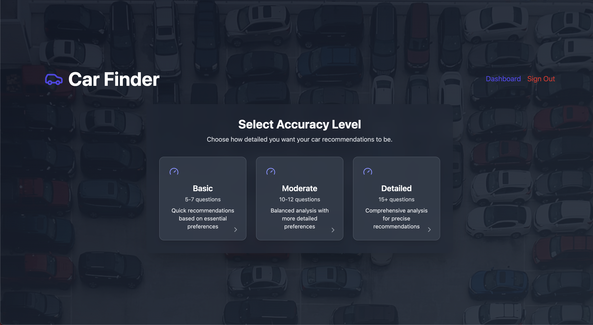

In today’s fast‐paced world, finding the perfect car can be overwhelming. With countless models, diverse features, and rapidly changing market trends, traditional car shopping methods are no longer enough. That’s why we built **Car Finder**—an innovative, AI‑powered platform that transforms your car buying journey by delivering personalized recommendations tailored exactly to your lifestyle, budget, and taste.

## Overview

Car Finder combines the latest in artificial intelligence, real‑time market data, and expert insights to create a seamless and engaging car shopping experience. Whether you’re a first‑time buyer or a seasoned auto enthusiast, our platform makes it easy to discover the car that truly fits your needs.

## Key Features

### 1. Personalized Car Recommendations

- **Tailored Questionnaire:**  
  Start by answering a few intuitive questions about your preferences. From your budget and desired car type to the features that matter most to you, our questionnaire gathers all the essential data needed to generate precise recommendations.

- **AI‑Driven Matching:**  
  Our sophisticated recommendation engine leverages your inputs along with real‑time market data and expert analysis to present you with a curated list of car options. Every interaction you have—whether it’s clicking on a car card or rating a suggestion—helps refine your future recommendations.

### 2. Dynamic Preference Learning

- **Real‑Time Feedback Tracking:**  
  Car Finder continuously monitors your interactions on the platform, such as which cars you click on, how long you view details, and the feedback you provide through upvotes or downvotes.

- **Continuous Model Improvement:**  
  This interaction data is stored securely and used to train our machine learning algorithms, ensuring that your recommendations improve over time. The more you interact, the smarter the suggestions become.

### 3. Interactive Dashboard

- **Detailed Car Profiles:**  
  Each car suggestion is accompanied by comprehensive details, including specifications, safety ratings, performance metrics, and expert reviews—helping you make an informed decision.

- **User Feedback Integration:**  
  Rate the suggestions you receive to further personalize your experience. Your feedback not only fine‑tunes your recommendations but also contributes to community insights for future users.

- **Visual Analytics:**  
  Our dashboard provides intuitive visual feedback on your past interactions and trends, allowing you to see how your preferences have evolved over time.

### 4. Engaging Mini‑Game Experience

- **Fun, Interactive Element:**  
  To add a playful twist to your experience, our landing page includes a mini‑game. Control a small car using your arrow keys as it roams across the screen. When you drive over a checkpoint (the red flag), an inspiring fact or message about Car Finder appears.

- **Realistic Movement:**  
  The game calculates smooth movement and rotation based on your key presses—if you press right and down simultaneously, the car moves diagonally and rotates accordingly, just like a real vehicle.

### 5. Comprehensive Blog & Resource Center

- **Expert Automotive Content:**  
  Stay informed with our regularly updated blog. Our articles cover everything from the latest market trends and fuel efficiency tips to expert reviews and maintenance guides.

- **SEO‑Optimized Insights:**  
  Each blog post is designed to be both engaging and informative, ensuring you get the best advice while also boosting our platform’s visibility.

### 6. Modern, Responsive Design

- **Seamless Experience Across Devices:**  
  Built with React, Tailwind CSS, and Framer Motion, Car Finder offers a smooth, responsive interface that works flawlessly on desktops, tablets, and mobile devices.

- **Intuitive UI & Smooth Animations:**  
  Our modern design and subtle animations ensure that every interaction feels polished and engaging without compromising performance.

### 7. Secure and Scalable Infrastructure

- **Robust Backend:**  
  Powered by Supabase, our platform handles real‑time data management, authentication, and secure storage, ensuring a reliable experience as your user base grows.

- **Optimized Performance:**  
  With image optimization, code splitting, and caching strategies in place, Car Finder loads quickly and performs efficiently—even under heavy traffic.

## Technology Stack

- **Frontend:** React, Next.js (or Create React App), Tailwind CSS, Framer Motion
- **Backend:** Supabase for real‑time database management, authentication, and API services
- **AI & ML:** OpenAI integration for dynamic preference learning and personalized recommendations
- **Additional Tools:** Google Analytics, Sentry for error monitoring, Cloudflare for CDN and security

## Benefits

- **Save Time:**  
  Receive tailored car suggestions quickly, without the need to sift through countless options manually.
- **Save Money:**  
  Get insights on fuel efficiency, maintenance costs, and overall value to make financially smart decisions.
- **Enhanced Experience:**  
  Engage with interactive elements like our mini‑game and personalized dashboard that make car shopping fun and informative.
- **Future‑Proof:**  
  As you interact with the platform, Car Finder learns and adapts—ensuring that your recommendations evolve along with your preferences.

## How It Works

1. **Answer a Quick Questionnaire:**  
   Provide your preferences and priorities through an intuitive form.
2. **Receive Personalized Recommendations:**  
   Our AI engine processes your input and market data to deliver a curated list of cars.
3. **Interact and Refine:**  
   Engage with detailed car profiles, provide feedback, and even enjoy a fun mini‑game—all of which help improve future suggestions.
4. **Make Informed Decisions:**  
   Compare options, read expert insights, and use our interactive dashboard to track your preferences over time.

## Conclusion

Car Finder is more than just a car shopping website—it's an AI‑driven ecosystem designed to revolutionize how you find your perfect car. With personalized recommendations, interactive features, a dynamic learning engine, and engaging content, Car Finder empowers you to make smarter, more confident car buying decisions.

Get started today and experience the future of car shopping!

---

_Join us on this journey and discover how Car Finder can transform your automotive experience. Stay tuned for more expert insights and updates on our blog!_
