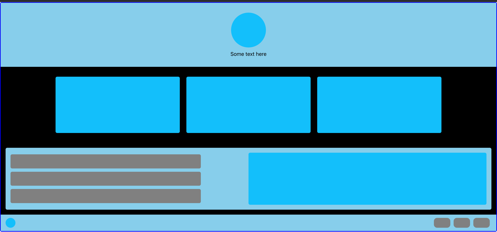

Let's explore the implementation of an animated mock webpage in React using AnimXYZ through a step-by-step guide.

Step 1: Set up a React project
To begin, create a new React project by executing the following command in your terminal:

```bash
npx create-react-app react-animxyz-tutorial
```

Navigate to the project folder:

```bash
cd react-animxyz-tutorial
```

Step 2: Install AnimXYZ
Add AnimXYZ to your React project by running the following command:

```bash
npm install @animxyz/react
```

If you encounter an npm error regarding the dependency tree resolution, re-run the command with the --legacy-peer-deps flag.

Start your React project:

```bash
npm run start
```

Visit http://localhost:3000 in your browser to see the initial version of the webpage.

Step 3: Style the webpage
Create a new file called styles.css in the src folder and apply the following CSS code to define the styling for various elements on the webpage:

```css
/* styles.css */
body {
  padding: 0;
}

/* Add styling for other elements as described in the original blog */
/* ... */
```

Step 4: Create the header
Generate the header of the webpage by creating a new file Header.jsx in the src folder and use the following code:

```jsx
// Header.jsx
import React from "react"

export default function Header() {
  return (
    <div
      className="page-hero"
      xyz="fade small stagger ease-out-back duration-30"
    >
      <div className="hero-logo xyz-nested"></div>
      <p className="hero-text xyz-nested">
        Curabitur blandit tempus porttitor. Morbi leo risus.
      </p>
    </div>
  )
}
```

Update the src/App.js file with the following code:

```jsx
// App.js
import React from "react"
import "./styles.css"
import Header from "./Header.jsx"
import "@animxyz/core"
import { XyzTransition } from "@animxyz/react"

export default function App() {
  return (
    <XyzTransition appear duration="auto">
      <div className="page-wrap">
        <Header />
      </div>
    </XyzTransition>
  )
}
```

Step 5: Create the body
Build the body of the webpage by creating a new file Body.jsx in the src folder and using the following code:

```jsx
// Body.jsx
import React from "react"

export default function Body() {
  return (
    <>
      <div
        className="page-features"
        xyz="fade flip-down stagger duration-10 delay-2 ease-out-back"
      >
        <div className="feature-item xyz-nested"></div>
        <div className="feature-item xyz-nested"></div>
        <div className="feature-item xyz-nested"></div>
      </div>

      <div
        className="page-section"
        xyz="fade small stagger delay-4 ease-in-out"
      >
        <div className="section-left" xyz="fade left stagger">
          <div className="section-item xyz-nested"></div>
          <div className="section-item xyz-nested"></div>
          <div className="section-item xyz-nested"></div>
        </div>
        <div className="section-right xyz-nested" xyz="fade big delay-10"></div>
      </div>
    </>
  )
}
```

Update the src/App.js file to include the Body component:

```jsx
// App.js
import React from "react"
import "./styles.css"
import Header from "./Header.jsx"
import Body from "./Body.jsx"
import "@animxyz/core"
import { XyzTransition } from "@animxyz/react"

export default function App() {
  return (
    <XyzTransition appear duration="auto">
      <div className="page-wrap">
        <Header />
        <Body />
      </div>
    </XyzTransition>
  )
}
```

Step 6: Create the footer
Finish by creating the footer of the webpage. Generate a new file Footer.jsx in the src folder and use the following code:

```jsx
// Footer.jsx
import React from "react"

export default function Footer() {
  return (
    <div className="page-footer" xyz="fade down ease-in-out delay-10">
      <div
        className="footer-logo xyz-nested"
        xyz="fade left ease-in-out delay-10"
      ></div>
      <div className="footer-right" xyz="fade up stagger ease-in-out delay-10">
        <div className="footer-item xyz-nested"></div>
        <div className="footer-item xyz-nested"></div>
        <div className="footer-item xyz-nested"></div>
      </div>
    </div>
  )
}
```

Update the src/App.js file to include the Footer component:

```jsx
// App.js
import React from "react"
import "./styles.css"
import Header from "./Header.jsx"
import Body from "./Body.jsx"
import Footer from "./Footer.jsx"
import "@animxyz/core"
import { XyzTransition } from "@animxyz/react"

export default function App() {
  return (
    <XyzTransition appear duration="auto">
      <div className="page-wrap">
        <Header />
        <Body />
        <Footer />
      </div>
    </XyzTransition>
  )
}
```

In conclusion, AnimXYZ proves to be an excellent library for crafting CSS animations in React. A comprehensive list of AnimXYZ utilities is available in the documentation's animation section, providing guidance on customization and insights into the library's underlying workings. Delve into AnimXYZ and unleash your creativity!
